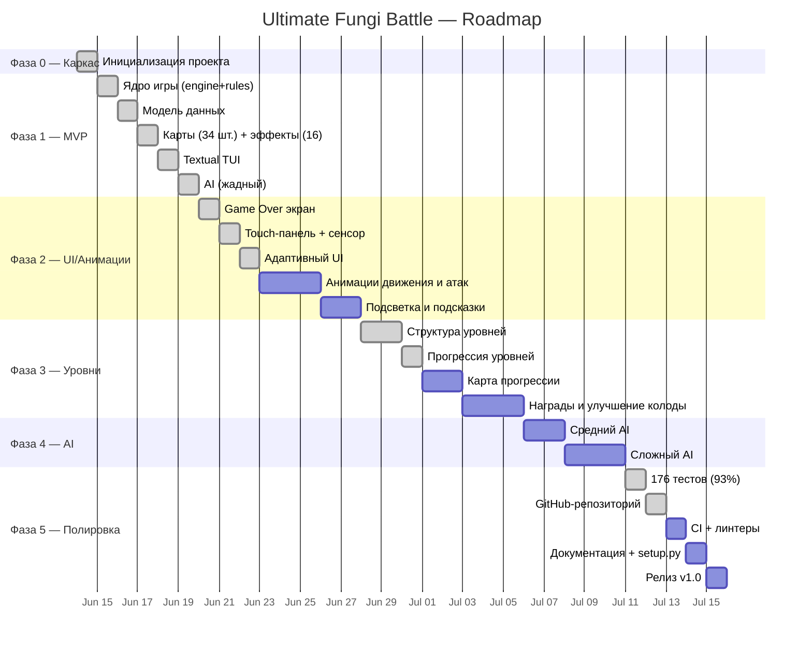

# Ultimate Fungi Battle — План разработки

> Карточная roguelike-игра в терминале (дух Inscryption / Hearthstone).
> 1 игрок против бота, поле 5×4, декбилдинг, прогрессия уровней.

---

## 1. Концепция

**Жанр:** карточная игра с элементами roguelike-прогрессии.

**Сеттинг:** мир грибов и мицелия. Игрок собирает колоду из грибов-воинов,
каждый со своей ролью — атакующий, защитник, поддержка, яд, вампиризм и т.д.

**Цель:** пройти серию уровней (ветвящаяся карта), побеждая вражеских ботов,
улучшая колоду по пути.

---

## 2. Базовая механика (MVP — реализовано)

### Поле боя

```
  Колонны:   1    2    3    4    5
           ┌────┬────┬────┬────┬────┐
  Ряд 0    │    │    │    │    │    │  ← Враг ставит сюда
  Ряд 1    │    │    │    │    │    │  ← Prepared-ряд врага
  Ряд 2    │    │    │    │    │    │  ← Prepared-ряд игрока
  Ряд 3    │    │    │    │    │    │  ← Игрок ставит сюда
           └────┴────┴────┴────┴────┘
```

- Ширина: 5 колонн, высота: 4 ряда.
- Игрок ставит карты в нижний ряд (row 3), враг — в верхний (row 0).
- Карты продвигаются к prepared-ряду (row 2 для игрока, row 1 для врага).
- При достижении prepared-ряда карта становится «готовой» и может атаковать.

### Ход игрока

1. **Начало хода:** добор 1 карты, пополнение золота (+1/ход).
2. **Главная фаза:** игрок может:
   - Сыграть карту (выбрать карту 1–4, затем колонну a–e).
   - Продать карту из руки (выбрать карту 1–4, нажать s).
   - Пропустить (p).
3. **Фаза атаки:** все prepared-карты игрока атакуют.
4. **Фаза продвижения:** неподготовленные карты двигаются вверх.
5. **Ход врага:** AI делает добор, играет карты, атакует, продвигает.
6. **Проверка победы:** если HP ≤ 0 — конец игры.

### Карты

- Каждая карта: ID, имя, стоимость (cost), атака (ATK), здоровье (HP), эффект.
- Рука: максимум 4 карты. При доборе сверх лимита карта идёт в сброс.
- Колода: 30 карт. При опустошении сброс тасуется и становится новой колодой.
- Продажа: игрок получает `floor(cost * 0.5)` золота.

### Параметры по умолчанию

| Параметр        | Значение |
|-----------------|----------|
| HP игрока/врага | 20       |
| Стартовое золото| 3        |
| Золото за ход   | 1        |
| Max рука        | 4        |
| Размер колоды   | 30       |
| Стоимость карт  | 1–5      |

---

## 3. Реализованные фичи

### Ядро игры (`src/game/engine.py`)
- ✅ Полный цикл хода: draw → play → attack → advance → enemy turn
- ✅ Система prepared-карт (продвижение к ряду готовности)
- ✅ Одновременное разрешение атак в фазе
- ✅ Сбор мёртвых карт в сброс
- ✅ Проверка победы/поражения

### Карты (`src/assets/cards.json`)
- ✅ 34 уникальные карты с русскими названиями
- ✅ ASCII-арт (верх/низ)
- ✅ 16 эффектов (см. ниже)
- ✅ Загрузчик `card_loader.py` для сборки колоды

### Система эффектов (`src/game/effects.py`)
- ✅ Плагинная система: эффекты регистрируются через `@register("id")`
- ✅ События: `deploy`, `prepare`, `attack`, `death`, `turn_start`
- ✅ 16 реализованных эффектов:

| Эффект              | Описание |
|---------------------|----------|
| `glow`              | При deploy — 1 урона лицу врага |
| `heal1` / `heal2`   | При deploy — лечит игрока на 1/2 HP |
| `gold` / `gold3`    | При deploy — даёт 1/3 золота |
| `poison`            | При attack — +1 урона |
| `deadly_poison`     | При attack — +2 урона |
| `fortify`           | При prepare — +1/+1 |
| `swift`             | При deploy — ставит в prepared-ряд |
| `drain`             | При attack — вампиризм (лечит = урону) |
| `spiky`             | При получении урона — 1 ответного |
| `double_strike`     | При attack — вторая атака |
| `taunt`             | Противник атакует эту карту первой |
| `stink`             | При prepare — враги теряют 1 ATK |
| `growth`            | Каждый turn_start — +1/+1 |
| `spores`            | При death — 2 урона лицу врага |

UI (`src/ui/textual_app.py`)
- ✅ Textual TUI с цветным интерфейсом
- ✅ Поле 5×4 с картами (▲ игрок ▼ враг ⚡ prepared)
- ✅ Рука с подсветкой выбранной карты
- ✅ Панель информации под курсором
- ✅ Верхняя панель: ход, HP, золото
- ✅ Управление клавишами (1–4, a–e, s, p, q, стрелки, Enter)

### AI (`src/game/ai.py`)
- ✅ Жадный AI: играет доступные карты по золоту
- ✅ Базовая архитектура для добавления уровней сложности

### Сохранение (`src/game/save.py`)
- ✅ Сохранение в JSON (placeholder)
- ✅ Загрузка из JSON

### Тесты (`src/tests/`)
- ✅ `test_deck.py` — тест тасовки и добора
- ✅ `test_engine.py` — тест play_card и draw

---

## 4. Плановые фичи (TODO)

### Фаза 2 — UI и анимации

- [x] **Экран Game Over** с опциями (рестарт / выход / следующий уровень)
- [x] **Подсветка колонн** при выборе размещения (3 состояния: col/target/invalid)
- [x] **Превью карт на поле** (имя, ATK/HP, эффект, cost) на самой клетке
- [x] **Сокращение длинных имён** карт на клетке поля и в руке
- [x] **Быстрая установка** карты: пробел/повторный выбор той же карты — поставить под курсором
- [x] **Сенсорное управление** (Termux + ПК): клик/тап по клетке, по карте, по кнопкам
- [x] **Touch-панель** с кнопками (4 карты, 5 колонок, действия, стрелки)
- [x] **Подсветка touch-кнопок** (active/danger) по доступности
- [x] **Адаптивный UI** — подстройка под любой размер экрана (Termux 40×20 — ПК 160×50)
  - Адаптивные CSS-классы: `-tiny` (w<50), `-narrow` (50-79), нормальный (≥80)
  - Фиксированные размеры клеток по 5 уровням ширины экрана
  - Полноразмерные карты в руке (имя + ATK/HP + эффект + описание) с 4+ строк
  - На крошечных экранах touch-панель и status-bar скрываются
- [ ] **Анимации движения карт** (плавное продвижение вверх/вниз)
- [ ] **Анимации атаки** (вспышка, уменьшение HP, дым)
- [ ] **Эффект печатающегося текста** (для описаний и событий)
- [ ] **Подтверждение опасных действий** (продажа дорогой карты)
- [ ] **Опция отключения анимаций** (для скорости)

### Фаза 3 — Уровни и прогрессия

- [x] **Структура уровней** (`src/game/levels.py`, 6 уровней)
- [x] **Прогрессия уровней** (рестарт / следующий уровень после победы)
- [ ] **Ветвящаяся карта прогрессии** (выбор следующего уровня)
- [ ] **Начальная колода** (вместо случайного набора)
- [ ] **Награды за уровень** (новые карты, золото, усиления)
- [ ] **Улучшение колоды** (добавление/удаление карт между уровнями)
- [ ] **Особые правила уровня** (например, «все карты стоят на 1 меньше», «стартовое золото 5»)
- [ ] **Сложность AI** (выбор перед уровнем: лёгкий / средний / сложный)

### Фаза 4 — AI разных уровней

- [ ] **Лёгкий AI** — играет первую доступную карту ✅ (реализован)
- [ ] **Средний AI** — эвристика: atk/cost ratio, приоритет атаки лица, заполнение колонн
- [ ] **Сложный AI** — оценочная функция + симуляция 1–2 ходов вперёд
- [ ] **Учёт эффектов** в оценке AI (лечение, яд, таунт)

### Фаза 5 — Дополнительные эффекты карт

- [ ] **shield** — блокирует первый урон каждый ход
- [ ] **freeze** — вражеская карта пропускает ход
- [ ] **haste** — карта движется на 2 ряда за ход
- [ ] **splash** — урон по соседним картам
- [ ] **rally** — при deploy даёт +1 ATK соседям
- [ ] **mushroom_king** — раз в ход воскрешает случайный гриб из сброса
- [ ] **spore_burst** — при destroy заполняет соседние клетки 1/1 спорами

### Фаза 6 — Полировка и инфраструктура

- [x] **Тесты покрытия** (pytest-cov, 176 тестов, 93% покрытие)
- [x] **GitHub-репозиторий** (https://github.com/bori-sus/Ultimate-fungi-battle)
- [x] **pytest-asyncio** (тесты адаптивного UI в headless-режиме)
- [ ] **Полное сохранение/загрузка** (GameState → JSON → GameState)
- [ ] **CI** (GitHub Actions: pytest, black, flake8)
- [ ] **Настройка линтеров** (pyproject.toml доведён)
- [ ] **requirements.txt** / pyproject.toml финальные
- [ ] **Документация** (README с гифкой/скриншотом)
- [ ] **setup.py / pip install** — one-command install

---

## 5. Архитектура проекта

```
ultimate-fungi-battle/
├── README.md
├── plan.md                  ← этот файл
├── pyproject.toml
├── requirements.txt
├── .github/workflows/ci.yml
└── src/
    ├── main.py              ← Точка входа (запускает Textual-приложение)
    │
    ├── game/                ← Ядро игры
    │   ├── __init__.py
    │   ├── engine.py        ← Игровой цикл, фазы хода, разрешение атак
    │   ├── state.py         ← GameState, Board, Cell, PlayerState
    │   ├── card.py          ← dataclass Card + сериализация
    │   ├── card_loader.py   ← Загрузка карт из JSON, сборка колоды
    │   ├── deck.py          ← Deck (тасовка Fisher–Yates, добор, сброс)
    │   ├── ai.py            ← AI (жадный, в перспективе — эвристики)
    │   ├── effects.py       ← Плагинная система эффектов (16 шт.)
    │   ├── levels.py        ← Конфигурации уровней (placeholder)
    │   └── save.py          ← Сохранение/загрузка JSON
    │
    ├── ui/                  ← Пользовательский интерфейс
    │   ├── __init__.py
    │   ├── textual_app.py   ← Textual TUI (основной интерфейс)
    │   ├── renderer.py      ← Rich-рендерер (запасной / заглушка)
    │   ├── input_handler.py ← Ввод с клавиатуры (заглушка)
    │   └── animations.py    ← Анимации (placeholder)
    │
    ├── assets/              ← Данные
    │   ├── cards.json       ← 34 карты с эффектами
    │   └── levels/          ← Уровни (JSON)
    │
    └── tests/
        ├── test_deck.py
        └── test_engine.py
```

### Стек технологий

| Компонент      | Технология         |
|----------------|-------------------|
| Язык           | Python ≥ 3.9      |
| TUI Framework  | Textual ≥ 0.40    |
| Rich           | (зависимость Textual) |
| Тесты          | pytest, pytest-asyncio, pytest-cov |
| Линтер         | black, flake8     |
| CI             | GitHub Actions    |
| Сохранение     | JSON (plain-text) |

### Адаптивный UI

UI подстраивается под ширину экрана (5 уровней):

| Ширина  | Клетка  | Карта в руке | Поведение |
|---------|---------|--------------|-----------|
| < 50    | 7×4     | 9×3 (без описания) | `-tiny`: touch-панель и status скрыты |
| 50–69   | 10×4    | 12×4 (с описанием) | `-narrow`: info-panel скрыт |
| 70–89   | 14×4    | 17×4 (с описанием) | обычный режим |
| 90–119  | 18×5    | 22×5 (с описанием) | обычный режим |
| ≥ 120   | 24×6    | 30×5 (с описанием) | просторный режим |

На **Termux в портрете** (40×20) — touch-панель скрыта (есть клавиатура), 
карты в руке показывают 2 строки (имя + статы), поле занимает 14 строк.

На **ПК** (120×40) — клетки большие (24×6), карты в руке полноразмерные (имя,
ATK/HP, эффект, описание), touch-панель видна.

---

## 6. Модель данных

```python
@dataclass
class Card:
    id: str              # уникальный идентификатор
    name: str            # название (рус.)
    cost: int            # стоимость в золоте (1-5)
    atk: int             # атака
    hp: int              # текущее здоровье
    max_hp: int          # максимальное здоровье
    description: str     # описание эффекта
    ascii_top: str       # верхняя часть ASCII-арта
    ascii_bottom: str    # нижняя часть ASCII-арта
    tags: list[str]      # теги (например, "ядовитый", "элитный")
    persistent: bool     # сохраняется ли между уровнями
    effect_id: str|None  # идентификатор эффекта

@dataclass
class Cell:
    owner: str|None      # 'player' | 'enemy' | None
    card: Card|None       # карта в клетке
    row: int, col: int    # координаты
    prepared: bool        # готовность к атаке

@dataclass
class Board:
    width, height         # 5×4
    grid: list[list[Cell]]

@dataclass
class PlayerState:
    hp, gold              # здоровье и золото
    deck: Deck             # колода
    hand: list[Card]       # рука (max 4)
    discard: list[Card]    # сброс

@dataclass
class GameState:
    board                 # поле 5×4
    player, enemy         # PlayerState
    turn_owner            # 'player' | 'enemy'
    turn_number            # номер хода
    rng_seed              # сид для воспроизводимости
    level_config          # настройки уровня
```

---

## 7. Система эффектов (архитектура)

Эффекты регистрируются декоратором `@register("effect_id")` в `effects.py`.
Движок вызывает `apply_effect(id, engine, owner, card_id, event)` в нужные моменты.

### События

| Событие       | Когда?                          |
|---------------|--------------------------------|
| `deploy`      | Карта только что сыграна на поле |
| `prepare`     | Карта достигла prepared-ряда    |
| `attack`      | Карта атакует                   |
| `death`       | HP карты ≤ 0, перед уходом в сброс |
| `turn_start`  | Начало хода владельца карты     |
| `damaged`     | Карта получила урон             |

### Возвращаемое значение

Функция эффекта может вернуть `dict` с модификаторами:

```python
{"extra_damage": 2}   # дополнительный урон при атаке
{"drain": True}       # вампиризм (лечение = урону)
{"double_strike": True}  # вторая атака
{"retaliate": 1}      # ответный урон атакующему
{"heal": 3}           # лечение владельца
{"gold": 2}           # бонус золота
```

---

## 8. AI

### Уровень «Лёгкий» (Easy) ✅

Жадный: играет первую карту в руке, цена которой ≤ золоту. Не продаёт, не планирует.

### Уровень «Средний» (Medium) [TODO]

- Оценка atk/cost ratio — выбирает лучшую карту по отношению ATK к стоимости для атаки лица.
- Заполняет пустые колонны, где враг может нанести урон.
- Может продать карту с низким atk/cost, если это позволит сыграть более сильную.

### Уровень «Сложный» (Hard) [TODO]

- Оценочная функция: симулирует 1–2 хода после каждого хода.
- Учитывает эффекты (лечение, яд, таунт, споры).
- Выбирает расстановку, максимизирующую ожидаемый урон по лицу врага и минимизирующий урон по своему.

---

## 9. Roadmap



---

## 10. Установка и запуск

```bash
# Клонирование
git clone https://github.com/bori-sus/Ultimate-fungi-battle
cd Ultimate-fungi-battle

# Установка зависимостей
pip install -r requirements.txt

# Запуск
python src/main.py
```

### Управление в игре

| Клавиша          | Действие |
|------------------|----------|
| `1`–`4`          | Выбрать карту в руке (повторный выбор — поставить под курсором) |
| `a`–`e`          | Выбрать колонну (после выбора карты) |
| `space`          | Поставить выбранную карту в колонку под курсором |
| `s`              | Продать выбранную карту |
| `p`              | Пропустить ход |
| `q`              | Выйти |
| `↑` `↓` `←` `→`  | Переместить курсор по полю |
| `Enter`          | Показать информацию о карте под курсором |
| `R` / `N`        | На экране Game Over: рестарт / следующий уровень |

### Сенсорное управление (Termux/ПК)

UI полностью дублируется touch-кнопками внизу экрана:
- `[1][2][3][4]` — выбор карты в руке
- `A B C D E` — выбор колонны
- `← ↑ ↓ →` — перемещение курсора
- `␣` (Поставить), `$` (Продать), `✓` (Пропуск) — действия

Также работает **клик/тап** по клеткам поля и картам в руке.

---

## 11. Лицензия

MIT
